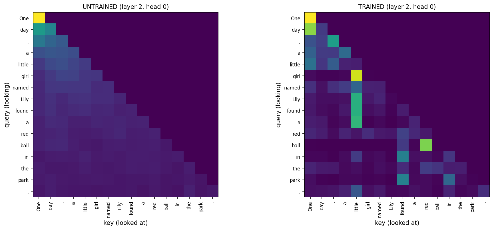

# GPT From Scratch: with Ablations

A ~30M-parameter GPT-style language model written from scratch in PyTorch (LLaMA-style: RoPE, RMSNorm, SwiGLU), trained on TinyStories, and used to run small controlled experiments on **positional encoding** and **normalization**.

[](https://colab.research.google.com/github/notmakgg-ux/GPT-build-by-me/blob/main/TrainingMyGPT.ipynb)


*Same head, same sentence. Left: untrained (attention is just the causal mask). Right: after 2,000 training steps.*

## Highlights

- Everything is built by hand: tokenizer wrapper, embeddings, RoPE, causal multi-head attention, RMSNorm, SwiGLU, the GPT class, the training loop, sampling, and evaluation. The only library pieces are PyTorch and the GPT-2 BPE tokenizer (`tiktoken`).
- Each component is tested before it is used: tokenizer roundtrip, RoPE relative-position property, causal-mask checks, residual-identity test, init loss ≈ ln(vocab), and a causality test on the full model.
- Four architecture variants trained with identical data, seed, and hyperparameters, plus a 3-seed noise estimate so the differences can be judged against run-to-run variation.
- Attention maps from the trained model and an untrained one for comparison.

## Results

### Ablation: position encoding × normalization

Validation loss on the full held-out set (lower is better), 2,000 steps each:

| Model | Params | Val loss | Perplexity | Bits/char | vs. baseline |
|---|---|---|---|---|---|
| RoPE + LayerNorm | 29.93M | **1.9622** | **7.11** | 0.696 | -0.004 |
| RoPE + RMSNorm *(baseline)* | 29.92M | 1.9663 | 7.14 | 0.698 | 0 |
| Learned + LayerNorm | 30.02M | 2.0385 | 7.68 | 0.723 | +0.072 |
| Learned + RMSNorm | 30.02M | 2.0447 | 7.73 | 0.726 | +0.078 |


**Noise estimate.** The baseline retrained with 3 seeds gives validation losses of 1.9663, 1.9658 and 1.9643, a spread of **0.0020**. Only differences clearly larger than that are meaningful.

**What the experiments show**

1. **RoPE beats learned absolute positions by about 0.077 loss (about 7.5% lower perplexity).** That is roughly 38× the seed-to-seed spread, and RoPE is ahead at every checkpoint. The gap shrinks during training, from 0.38 at step 250 to 0.076 at step 2000, so learned positions are catching up but have not closed the gap within this budget.
2. **LayerNorm is slightly better than RMSNorm (about 0.004 to 0.006 loss).** The edge appears in both pairs and at every checkpoint, and is about twice the noise spread. I'd call it probably real but tiny (about 0.2% of the loss). Noise was only measured for one configuration, with 3 seeds.
3. **Training speed:** the RMSNorm runs were about 6% slower in wall-clock time. This probably says more about my plain-PyTorch RMSNorm versus PyTorch's fused `LayerNorm` kernel than about the methods themselves.

### Learned position embeddings are not random


After training, the learned position table shows a smooth structure: neighboring positions have an average cosine similarity of **0.443**, while positions 128 apart have **-0.052**. The model discovers a "distance" structure that RoPE builds in by construction.

### What the attention heads do

| | |
|---|---|
|  |  |


On a 16-token sentence a head with no preference scores about 0.16 on each metric, so values near 0.16 mean "no simple positional role". Observations (from a single example sentence, so treat them as hypotheses):

- **Layer 0, head 3 is a clear previous-token head** (score 0.47, about 3× chance).
- Several heads act as **attention sinks**, parking attention on the first token (e.g. layer 0 heads 1 and 5).
- Some heads look content-driven: in one head "girl" attends almost entirely to "little", and in the last layer one head has a vertical band on "girl".
- Heads rarely attend to themselves (scores as low as 0.05).
- In the single test sentence, the RoPE model has its sharpest previous-token head in **layer 0 (0.47)**, whereas the learned-position model's best heads are in **layers 3 and 4 (0.35, 0.37)**.

### Sample generations

Prompt → continuation (temperature 0.8, top-k 50):

```
[paste 2-3 of your best samples from Step 5 here]
```

## Model

| | |
|---|---|
| Parameters | 29.92M (baseline) |
| Layers / heads / d_model | 6 / 6 / 384 |
| FFN | SwiGLU, hidden 1024 (8/3 × d_model, rounded to a multiple of 64) |
| Context length | 256 |
| Vocabulary | 50,257 (GPT-2 BPE via `tiktoken`) |
| Positions | RoPE (or learned, for the ablation) |
| Norm | RMSNorm (or LayerNorm, for the ablation), pre-norm |
| Output layer | tied with the token embedding |
| Init | N(0, 0.02), residual projections scaled by 1/√(2·layers) |

64% of the parameters are the token embedding table, which is normal for a small model with a large vocabulary.

## Training setup

| | |
|---|---|
| Data | TinyStories (`TinyStoriesV2-GPT4-valid.txt`), [N] tokens, 90/10 train/val split |
| Batch | 32 sequences × 256 tokens |
| Steps | 2,000 (about 16M tokens) |
| Optimizer | AdamW (β = 0.9, 0.95), weight decay 0.1 on weight matrices only |
| LR schedule | 100-step linear warmup, then cosine decay from 6e-4 to 6e-5 |
| Gradient clipping | 1.0 |
| Precision | Mixed (fp16 with GradScaler, or bf16 on newer GPUs) |
| Time | about 9 minutes per run on a single Colab [GPU name] |

All runs use the same seed and the same batch order (a seeded generator), so the architectures are the only difference between them.

## Run it yourself

1. Open the notebook in Colab (badge above).
2. Set **Runtime → Change runtime type → GPU**.
3. Run the cells from top to bottom. Section 8 trains the baseline, and section 12 trains the ablation variants (about 30 minutes in total on a single GPU, plus about 18 minutes for the optional noise runs).

Or locally:

```bash
git clone https://github.com/notmakgg-ux/GPT-build-by-me.git
cd GPT-build-by-me
pip install -r requirements.txt
jupyter notebook TrainingMyGPT.ipynb
```

## Notebook structure

1. Tokenization
2. Embedding
3. Positional encoding (RoPE)
4. Attention (with a toy 3-token walkthrough)
5. Transformer block (RMSNorm, SwiGLU, residuals)
6. GPT model
7. Data
8. Training
9. Generation (temperature, top-k, top-p)
10. Evaluation
11. Attention visualization
12. Ablation experiments

## Limitations

- One dataset (TinyStories), one context length (256), 2,000 training steps, and about 30M parameters. Conclusions may not transfer to larger models or longer training.
- The learned-vs-RoPE gap is still shrinking at the end of training, so it may narrow further with more steps. This experiment can't tell.
- Noise was measured with 3 seeds on the baseline only. Differences below about 0.002 should be treated as noise.
- Attention observations come from a single example sentence.
- No KV-cache, so generation is slower than it could be.

## What I learned

- A fresh model must start at a loss near ln(vocab size). Mine did (10.89 vs. 10.83), and that single check catches many bugs.
- Position encoding mattered much more than normalization at this scale.
- An ablation without a noise estimate can't tell a real effect from a lucky seed.
- [Add 1-2 personal lessons: a bug you hit, something that surprised you.]

## Roadmap

- [ ] KV-cache for faster generation
- [ ] Longer training runs to test whether the RoPE advantage persists
- [ ] Train on a custom dataset (e.g. Hinglish text)
- [ ] Gradio demo on Hugging Face Spaces
- [ ] Upload trained weights to Hugging Face

## Acknowledgements

TinyStories dataset by Eldan & Li. RoPE (Su et al.), RMSNorm (Zhang & Sennrich), SwiGLU (Shazeer), and the GPT-2 initialization recipe from the GPT-2 paper.

## License

MIT
