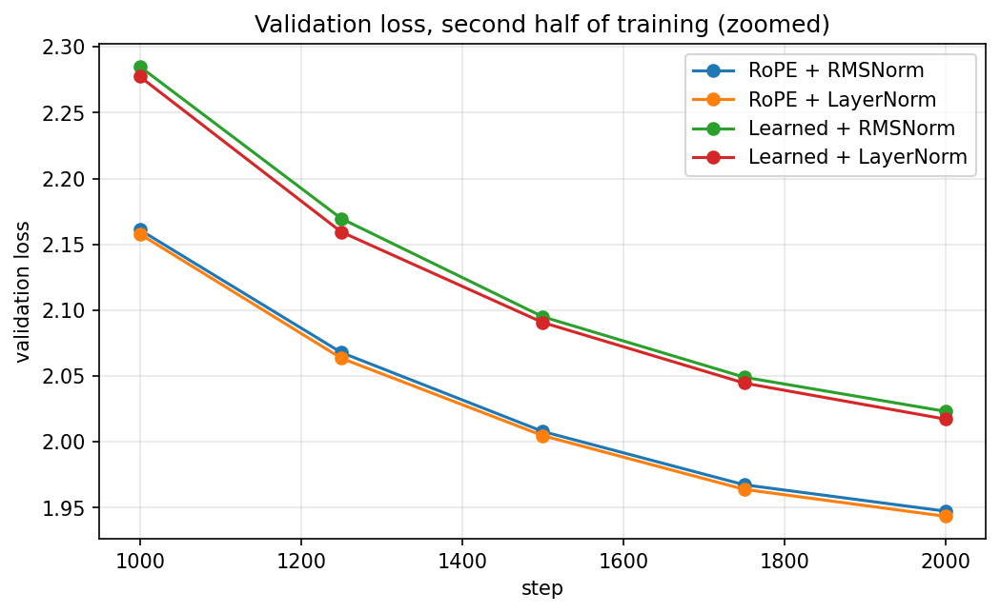
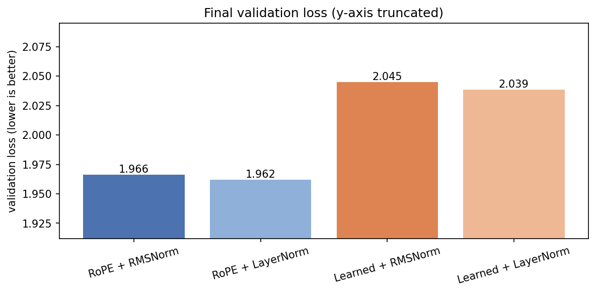
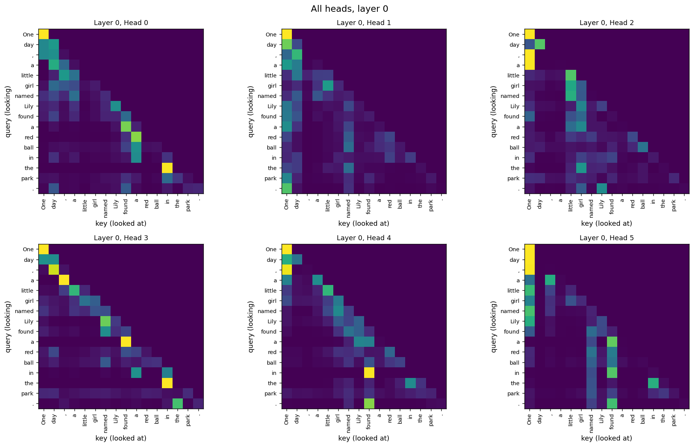
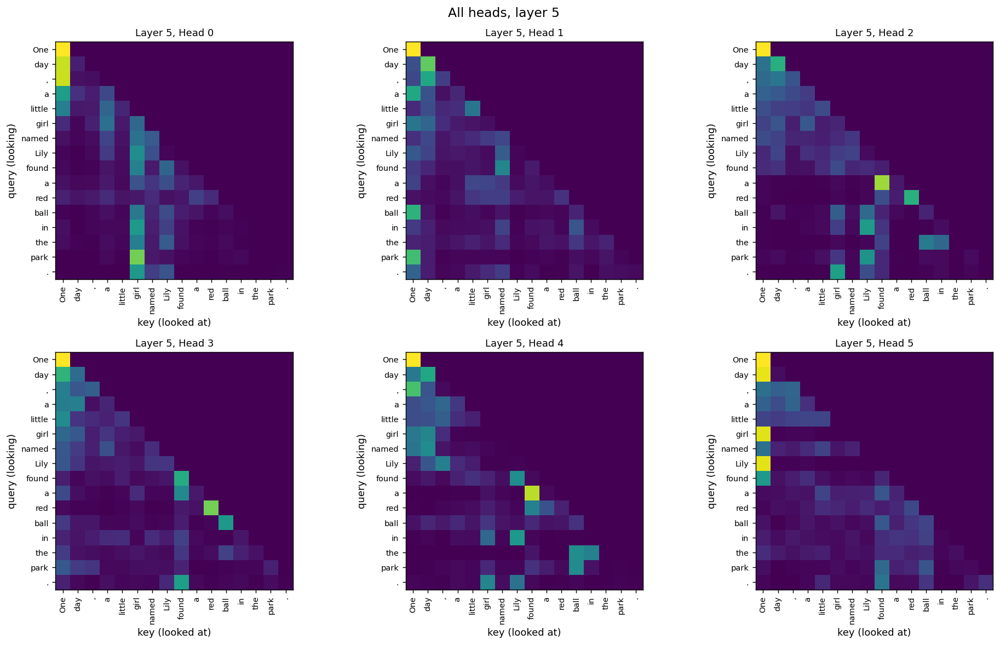
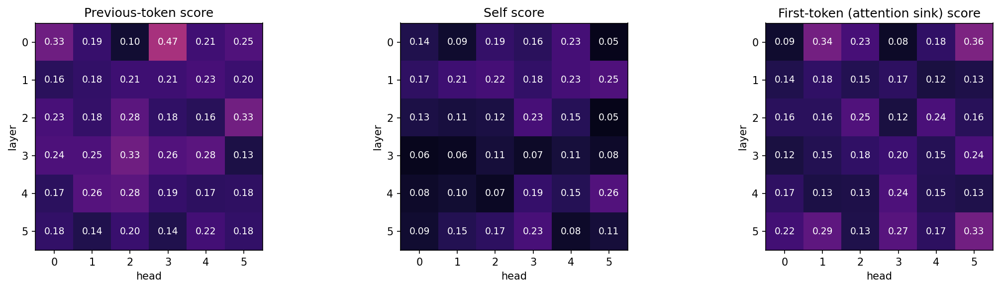
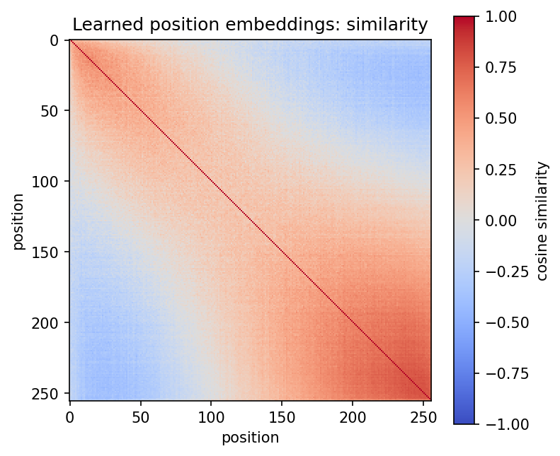

# GPT From Scratch: Controlled Ablations on Position Encoding and Normalization

A \~30M-parameter GPT-style language model implemented from scratch in
PyTorch, using a LLaMA-inspired architecture with **RoPE, RMSNorm,
SwiGLU, causal self-attention, tied embeddings, and pre-normalization**.

The model is trained on **TinyStories** and used to run controlled
ablation experiments investigating two architectural choices:

-   **Positional encoding:** RoPE vs. learned absolute positional
    embeddings
-   **Normalization:** RMSNorm vs. LayerNorm

The experiments use the same dataset, training budget, batch ordering,
initialization strategy, and hyperparameters so that the architectural
differences can be studied in a controlled way.

> **Main finding:** At this scale and training budget, positional
> encoding had a substantially larger effect than normalization. RoPE
> consistently outperformed learned positional embeddings, while
> LayerNorm provided only a small advantage over RMSNorm.

[](https://colab.research.google.com/github/notmakgg-ux/GPT-build-by-me/blob/main/TrainingMyGPT.ipynb)

------------------------------------------------------------------------

## Attention Before vs. After Training


*Same attention head and same sentence. Before training, attention is
dominated by the causal constraint; after training, the model develops
structured attention patterns.*

------------------------------------------------------------------------

# Highlights

-   **Built from scratch in PyTorch:** tokenizer wrapper, embeddings,
    RoPE, causal multi-head attention, RMSNorm, LayerNorm, SwiGLU,
    Transformer blocks, GPT model, training loop, sampling, and
    evaluation.
-   **LLaMA-inspired architecture:** RoPE + RMSNorm + SwiGLU with
    pre-normalization.
-   **\~30M parameters:** small enough to train and experiment with on a
    single Google Colab T4.
-   **Controlled ablations:** RoPE vs. learned positional embeddings and
    RMSNorm vs. LayerNorm.
-   **Reproducible comparisons:** the ablations use the same dataset,
    training budget, batch ordering, and general hyperparameters.
-   **Sanity checks before training:** tokenizer round-trip, RoPE
    relative-position behavior, causal masking, residual identity,
    initialization loss, and full-model causality.
-   **Attention analysis:** visualization of trained vs. untrained
    attention and positional/content-related head behavior.
-   **Generation experiments:** greedy decoding and
    temperature-controlled sampling.
-   **Noise estimation:** three baseline seeds to distinguish
    architectural effects from ordinary run-to-run variation.

------------------------------------------------------------------------

# Why Build a GPT From Scratch?

Large language models are often used through high-level libraries where
most architectural details are hidden.

This project was built to understand what actually happens inside a
Transformer by implementing the major components directly.

Instead of only asking:

> "Can I train a language model?"

the project also asks:

> **"Which architectural choices actually matter for a small language
> model under controlled conditions?"**

The result is both an educational implementation and a small
experimental study.

------------------------------------------------------------------------

# Results

## Ablation: Position Encoding × Normalization

Four model configurations were trained using the same experimental
setup.

**Lower validation loss and perplexity are better.**

  --------------------------------------------------------------------------
  Model              Parameters     Validation     Perplexity Δ vs. Baseline
                                          Loss                
  -------------- -------------- -------------- -------------- --------------
  **RoPE +           29,925,504     **1.9622**       **7.11**    **-0.0041**
  LayerNorm**                                                 

  **RoPE +           29,920,512         1.9663           7.14         0.0000
  RMSNorm**                                                   
  *(baseline)*                                                

  **Learned +        30,023,808         2.0385           7.68        +0.0722
  LayerNorm**                                                 

  **Learned +        30,018,816         2.0447           7.73        +0.0785
  RMSNorm**                                                   
  --------------------------------------------------------------------------

### Key result

The largest difference comes from **positional encoding**.

Comparing models with RMSNorm:

``` text
RoPE + RMSNorm       1.9663
Learned + RMSNorm    2.0447
```

Difference:

``` text
2.0447 - 1.9663 = 0.0784
```

RoPE therefore achieved a substantially lower validation loss than
learned absolute positional embeddings under this training setup.

The normalization effect was much smaller:

``` text
RoPE:
LayerNorm = 1.9622
RMSNorm   = 1.9663
Difference = 0.0041

Learned positions:
LayerNorm = 2.0385
RMSNorm   = 2.0447
Difference = 0.0062
```

This suggests that, for this particular model size, dataset, context
length, and training budget:

> **Position encoding mattered much more than normalization.**

------------------------------------------------------------------------

## Ablation Curves



The RoPE configurations remain ahead of the learned-position
configurations throughout the training process.

The gap becomes smaller during training, suggesting that the
learned-position models are catching up, but they do not close the gap
within the 2,000-step training budget.

------------------------------------------------------------------------

## Final Validation Loss



The final comparison shows a clear separation between the
positional-encoding choices and a much smaller difference between
normalization methods.

------------------------------------------------------------------------

# Seed-to-Seed Noise

A controlled experiment needs to account for ordinary training
variation.

The baseline model was retrained using three different random seeds:

  Seed       Validation Loss
  -------- -----------------
  Seed 1              1.9663
  Seed 2              1.9658
  Seed 3              1.9643

The observed spread was approximately:

**0.0020 validation loss**

The RoPE vs. learned-position difference is approximately:

**0.0784**

which is much larger than the measured seed-to-seed variation.

The normalization difference, however, is much smaller:

**0.0041--0.0062**

Therefore, the positional-encoding result is considerably more
convincing than the normalization result.

> **Important:** Noise was measured using three seeds for the baseline
> configuration only. It should not be interpreted as a complete
> uncertainty estimate for every architecture.

------------------------------------------------------------------------

# What the Ablation Shows

## 1. RoPE vs. Learned Positional Embeddings

RoPE outperformed learned absolute positional embeddings in both
normalization settings.

  Normalization       RoPE   Learned   RoPE Advantage
  --------------- -------- --------- ----------------
  RMSNorm           1.9663    2.0447       **0.0784**
  LayerNorm         1.9622    2.0385       **0.0763**

The advantage remains large compared with the measured seed variation.

However, the gap shrinks during training.

This is important because it prevents overclaiming the result.

The experiment demonstrates:

> **Under this model size, context length, dataset, and 2,000-step
> training budget, RoPE performs better than learned absolute
> positions.**

It does **not** demonstrate that learned positional embeddings can never
catch up with RoPE given more training or a different experimental
setup.

------------------------------------------------------------------------

## 2. LayerNorm vs. RMSNorm

LayerNorm performed slightly better than RMSNorm in both
positional-encoding settings.

  Position Encoding     LayerNorm   RMSNorm   Difference
  ------------------- ----------- --------- ------------
  RoPE                     1.9622    1.9663       0.0041
  Learned                  2.0385    2.0447       0.0062

The effect is relatively small.

The result should therefore be interpreted more cautiously than the
positional-encoding result.

------------------------------------------------------------------------

## 3. Training Speed

The RMSNorm runs were approximately **6% slower in wall-clock time** in
this implementation.

This should not be interpreted as evidence that RMSNorm itself is
inherently slower.

The implementation uses plain PyTorch operations, while PyTorch's
`LayerNorm` benefits from highly optimized kernels.

A fused RMSNorm implementation or a different hardware/software stack
could produce different results.

------------------------------------------------------------------------

# Baseline Training Run

The baseline configuration was trained for 2,000 steps on a Google Colab
NVIDIA T4.

``` text
=== baseline_rope_rmsnorm | 29,920,512 params ===

step     0 | val loss 10.8908 | 2s
step   250 | val loss 2.9118  | 69s
step   500 | val loss 2.4882  | 136s
step   750 | val loss 2.2874  | 203s
step  1000 | val loss 2.1611  | 270s
step  1250 | val loss 2.0679  | 337s
step  1500 | val loss 2.0079  | 404s
step  1750 | val loss 1.9674  | 470s
step  2000 | val loss 1.9474  | perplexity 7.01 | total 537s
```

### Final baseline run

  Metric                                           Result
  ----------------------- -------------------------------
  Parameters                               **29,920,512**
  Steps                                         **2,000**
  Final validation loss                        **1.9474**
  Perplexity                                     **7.01**
  Training time             **537 seconds (\~9 minutes)**
  Hardware                     **Google Colab NVIDIA T4**

The ablation table above uses the controlled baseline result of
**1.9663**. The 1.9474 result is from a separate baseline training run
used for the main training/generation demonstration.

------------------------------------------------------------------------

# Initialization Sanity Check

For a randomly initialized model whose output distribution is
approximately uniform, the expected cross-entropy loss is approximately:

\[ L `\approx `{=tex}`\ln`{=tex}(\|V\|) \]

With a vocabulary of 50,257 tokens:

\[ `\ln`{=tex}(50257) `\approx 10.824`{=tex} \]

The observed initial validation loss was:

``` text
10.8908
```

This is close to the expected random-prediction baseline.

This simple check is useful because it can catch problems with:

-   output logits
-   vocabulary size
-   initialization
-   loss computation
-   token targets
-   model wiring

before spending significant time training.

------------------------------------------------------------------------

# Dataset

The model was trained on **TinyStories**, using:

``` text
TinyStoriesV2-GPT4-valid.txt
```

Dataset statistics:

  Metric                               Value
  -------------------------- ---------------
  Total tokens                 **5,532,654**
  Training tokens              **4,979,388**
  Validation tokens              **553,266**
  Train / validation split       **90 / 10**
  Characters per token              **4.07**

The training budget was 2,000 steps with:

``` text
32 sequences × 256 tokens
```

which corresponds to:

``` text
8,192 tokens / step
```

and approximately:

``` text
16.4M token positions processed
```

over 2,000 steps.

------------------------------------------------------------------------

# Model Architecture

The baseline is a small GPT-style Transformer inspired by modern
LLaMA-family design choices.

  Component                     Configuration
  ----------------------------- -------------------------------
  Parameters                    **29.92M** baseline
  Layers                        6
  Attention heads               6
  Model dimension               384
  Context length                256
  Vocabulary                    50,257
  Tokenizer                     GPT-2 BPE via `tiktoken`
  Position encoding             RoPE
  Ablation position encoding    Learned absolute embeddings
  Normalization                 RMSNorm
  Ablation normalization        LayerNorm
  Transformer style             Pre-norm
  FFN                           SwiGLU
  FFN hidden dimension          1024
  Output embeddings             Tied with token embeddings
  Initialization                Normal distribution, σ = 0.02
  Residual projection scaling   1 / √(2 × layers)

------------------------------------------------------------------------

# Architecture Diagram

``` text
                     Input Text
                         │
                         ▼
                  GPT-2 BPE Tokenizer
                         │
                         ▼
                   Token Embeddings
                         │
                         ▼
              ┌─────────────────────┐
              │ Transformer Block 1 │
              │                     │
              │   RMSNorm           │
              │      ↓              │
              │  Causal Attention   │
              │      +              │
              │     RoPE            │
              │      ↓              │
              │  Residual           │
              │      ↓              │
              │   RMSNorm           │
              │      ↓              │
              │    SwiGLU            │
              │      ↓              │
              │  Residual           │
              └─────────────────────┘
                         │
                         ▼
                    × 6 Layers
                         │
                         ▼
                      RMSNorm
                         │
                         ▼
                 Tied Output Head
                         │
                         ▼
                     Logits
                         │
                         ▼
                  Token Probabilities
                         │
                         ▼
                    Next Token
```

------------------------------------------------------------------------

# Why SwiGLU?

Instead of a traditional Transformer feed-forward network, the model
uses **SwiGLU**.

The general structure is:

\[ `\text{SwiGLU}`{=tex}(x) = `\text{SiLU}`{=tex}(xW_g) `\odot`{=tex}
(xW_u) \]

followed by a projection back to the model dimension.

The hidden dimension is approximately:

\[ `\frac{8}{3}`{=tex}d\_{model} \]

rounded to a convenient multiple.

For:

``` text
d_model = 384
```

the implementation uses:

``` text
hidden dimension = 1024
```

------------------------------------------------------------------------

# Weight Tying

The output projection shares weights with the token embedding matrix.

Instead of maintaining completely independent matrices:

``` text
Input Embedding
Output Projection
```

the same learned weight matrix is reused.

This reduces parameter count and is a common technique in language
models.

Approximately **64% of the model parameters** are contained in the token
embedding table because the model has a relatively large 50,257-token
vocabulary compared with its 384-dimensional hidden representation.

------------------------------------------------------------------------

# Attention

The model uses causal multi-head self-attention.

For each token, the attention mechanism computes:

\[ Q = XW_Q \]

\[ K = XW_K \]

\[ V = XW_V \]

and:

\[ Attention(Q,K,V) = softmax `\left`{=tex}(
`\frac{QK^T}{\sqrt{d_k}}`{=tex} + M `\right`{=tex})V \]

where `M` is the causal mask preventing tokens from attending to future
positions.

RoPE is applied to the query and key representations before calculating
attention scores.

------------------------------------------------------------------------

# Attention Visualization

## Untrained vs. Trained


The untrained model mostly reflects the causal structure imposed by the
mask.

After training, the same attention head develops structured patterns
that depend on the input sequence.

This provides a useful visual demonstration that attention heads are not
simply passive implementations of the mask: training causes them to
learn particular patterns of information routing.

------------------------------------------------------------------------

## Layer 0



------------------------------------------------------------------------

## Final Layer



------------------------------------------------------------------------

## Attention Head Roles



For a 16-token sentence, a head with no strong positional preference
scores approximately **0.16** on each metric.

Some observed patterns include:

-   **Layer 0, head 3** behaves like a strong previous-token head with a
    score of approximately **0.47**.
-   Several heads appear to behave like **attention sinks**,
    concentrating attention on the first token.
-   Some heads appear more content-driven than position-driven.
-   Some heads show low self-attention.
-   In the inspected example, RoPE's strongest previous-token head
    appeared in an earlier layer than the strongest corresponding
    learned-position heads.

These observations are based on selected examples and should therefore
be treated as exploratory rather than universal claims.

------------------------------------------------------------------------

# Learned Positional Embeddings



The learned positional embedding table develops a smooth structure
during training.

Measured cosine similarities:

  Position Relationship     Average Cosine Similarity
  ----------------------- ---------------------------
  Neighboring positions                     **0.443**
  Positions 128 apart                      **-0.052**

This is interesting because the model discovers positional relationships
from the training data.

RoPE, on the other hand, introduces relative positional structure
directly through the attention mechanism.

This provides a useful conceptual contrast:

> **Learned positional embeddings discover positional structure through
> optimization, while RoPE builds relative-position structure into the
> architecture.**

------------------------------------------------------------------------

# Next-Token Predictions

The trained model was also inspected by looking at the probability
distribution over possible next tokens.

These examples show that the model has learned meaningful local language
statistics from TinyStories.

------------------------------------------------------------------------

## Prompt: `Once upon a`

``` text
99.9%  ' time'
 0.0%  ' walk'
 0.0%  ' while'
 0.0%  ' few'
 0.0%  ' day'
 0.0%  ' week'
 0.0%  ' journey'
 0.0%  ' moment'
```

The model strongly associates:

``` text
Once upon a → time
```

------------------------------------------------------------------------

## Prompt: `The little girl was very`

``` text
42.2%  ' happy'
10.8%  ' sad'
10.6%  ' excited'
 4.0%  ' curious'
 2.7%  ' surprised'
 2.6%  ' proud'
 1.9%  ' glad'
 1.8%  ' scared'
```

Rather than assigning probability uniformly, the model has learned a
meaningful distribution of plausible continuations.

------------------------------------------------------------------------

## Prompt: `She picked up the ball and`

``` text
16.8%  ' threw'
13.7%  ' ran'
10.3%  ' put'
 9.9%  ' started'
 4.3%  ' said'
 4.0%  ' took'
 3.2%  ' tried'
 3.0%  ' went'
```

------------------------------------------------------------------------

## Prompt: `The sun is`

``` text
17.6%  ' shining'
 9.6%  ' hot'
 8.3%  ' going'
 6.8%  ' very'
 5.1%  ' bright'
 3.6%  ' ready'
 3.2%  ' not'
 3.0%  ' warm'
```

These distributions provide a direct view into the model's learned
next-token behavior.

------------------------------------------------------------------------

# Sample Generations

The following examples were generated using the trained baseline model.

------------------------------------------------------------------------

## Prompt: `Once upon a time`

### Default Sampling

``` text
Once upon a time, there was a little boy named Tim. Tim had a friend, a big cat named Sam. They liked to play all day long. One day, they wanted to make a big mess in the kitchen. They opened the door and found a lot of mess.

Tim said, "Sam, I want to make a mess. Let's clean up it at the kitchen." They found a cup
```

------------------------------------------------------------------------

## Prompt: `One day, a little girl named Lily`

``` text
One day, a little girl named Lily went to the store with her mom. Lily had a toy named Mr. Bear. Lily liked to play with Mr. Whiskers. They had lots of fun playing together in the store.

While Lily was playing, Mr. Whiskers saw a little boy named Tim. Tim asked, "Do you want to play with me?" Lily looked sad at him and said, "I want
```

------------------------------------------------------------------------

## Prompt: `The dog ran to the park and`

``` text
The dog ran to the park and saw the dog. The dog was hiding behind a tree. The dog was playing and laughing at the dog. The dog said, "I am sorry for being selfish, dog. We can be friends."

The big dog and the dog played all day. They had so much fun. They were happy. They learned that sometimes, things can bring happiness.
```

------------------------------------------------------------------------

# Sampling Experiments

The model was also tested with different decoding strategies and
temperatures.

## Greedy Decoding

``` text
Once upon a time, there was a little girl named Lily. She loved to play outside in the sun. One day, she saw a big, red ball. She wanted to play with it.

Lily tried to push the ball, but it was too heavy. She tried and tried, but she could not reach it. She felt
```

Greedy decoding always selects the highest-probability token and
therefore tends to produce more deterministic text.

------------------------------------------------------------------------

## Temperature = 0.5

``` text
Once upon a time, there was a little boy named Tim. Tim loved to play outside with his friends. One day, Tim and his friends decided to go outside and play.

As they went outside, Tim saw a big, scary bear. The bear was very big and scary. Tim wanted to stop the bear, but his friends said
```

Lower temperature reduces randomness and generally makes the output more
conservative.

------------------------------------------------------------------------

## Temperature = 0.8

``` text
Once upon a time, there was a little boy named Tim. Tim loved to play outside with his ball. One day, his ball rolled away behind a tree. Tim was very sad because he did not know where his ball went.

Tim found his ball near the tree. It was a little girl named Sue. Sue saw Tim's ball
```

This produces a balance between deterministic and diverse generation.

------------------------------------------------------------------------

## Temperature = 1.2

``` text
Once upon a time, there was a little boy named Tim. Tim liked to play games with his ball. One day, his friend, Sam, came to play. It was fun because it was his favorite toy.

As Sam played, Tim felt sleepy. He looked at his red ball and said, "Okay, I like your
```

Higher temperature produces more variation but also increases the
probability of incoherent or unexpected continuations.

------------------------------------------------------------------------

# Training Setup

  Configuration                       Value
  ----------------------------------- --------------------------------
  Dataset                             TinyStories
  Dataset file                        `TinyStoriesV2-GPT4-valid.txt`
  Total tokens                        **5,532,654**
  Training tokens                     **4,979,388**
  Validation tokens                   **553,266**
  Train / validation split            **90 / 10**
  Batch size                          **32 sequences**
  Sequence length                     **256 tokens**
  Tokens / batch                      **8,192**
  Training steps                      **2,000**
  Approx. token positions processed   **16.4M**
  Optimizer                           AdamW
  β₁                                  0.9
  β₂                                  0.95
  Weight decay                        0.1 on weight matrices
  Peak learning rate                  6e-4
  Final learning rate                 6e-5
  Warmup                              100 steps
  LR schedule                         Cosine decay
  Gradient clipping                   1.0
  Precision                           Mixed precision
  Hardware                            **Google Colab NVIDIA T4**
  Baseline runtime                    **\~9 minutes**

All controlled ablation runs use the same general training setup.

------------------------------------------------------------------------

# Training Pipeline

``` text
                  TinyStories
                       │
                       ▼
                 GPT-2 BPE
                  Tokenizer
                       │
                       ▼
                Token Sequences
                  (256 tokens)
                       │
                       ▼
               Token Embeddings
                       │
                       ▼
          ┌─────────────────────────┐
          │    Transformer × 6      │
          │                         │
          │      RMSNorm            │
          │          ↓              │
          │   Causal Self-Attention │
          │          ↓              │
          │         RoPE            │
          │          ↓              │
          │      Residual           │
          │          ↓              │
          │      RMSNorm            │
          │          ↓              │
          │       SwiGLU            │
          │          ↓              │
          │      Residual           │
          └─────────────────────────┘
                       │
                       ▼
                    RMSNorm
                       │
                       ▼
                Tied LM Head
                       │
                       ▼
                    Logits
                       │
                       ▼
              Cross-Entropy Loss
                       │
                       ▼
                    AdamW
                       │
                       ▼
                  Backprop
```

------------------------------------------------------------------------

# Reproducibility

The ablation experiments were designed so that the architecture is the
main changing variable.

The experiments use:

-   identical dataset
-   identical train/validation split
-   identical context length
-   identical batch size
-   identical number of training steps
-   identical optimizer setup
-   identical learning-rate schedule
-   identical general initialization strategy
-   seeded batch ordering

This makes the comparison more meaningful than independently training
each architecture with unrelated random conditions.

------------------------------------------------------------------------

# Sanity Checks

The notebook includes several implementation-level checks.

## 1. Tokenizer Round Trip

Text is tokenized and decoded again to verify that the tokenizer wrapper
behaves correctly.

------------------------------------------------------------------------

## 2. RoPE Relative Position Test

The rotary positional embedding implementation is tested for its
expected relative-position behavior.

------------------------------------------------------------------------

## 3. Causal Mask Test

The attention mask is checked to make sure that:

``` text
token i cannot attend to token j
when j > i
```

This is critical for autoregressive language modeling.

------------------------------------------------------------------------

## 4. Residual Identity Test

Residual connections are tested by forcing the transformed branch toward
zero and verifying that the block behaves approximately like the
identity function.

------------------------------------------------------------------------

## 5. Initialization Loss

The initial loss is compared with:

\[ `\ln`{=tex}(\|V\|) \]

For the 50,257-token vocabulary:

``` text
Expected ≈ 10.824
Observed = 10.8908
```

------------------------------------------------------------------------

## 6. Full-Model Causality

The complete model is tested to make sure future tokens cannot affect
predictions at earlier positions.

------------------------------------------------------------------------

# Notebook Structure

The notebook progresses from individual building blocks to complete
experiments.

``` text
1. Tokenization
2. Embedding
3. Positional Encoding
4. RoPE
5. Attention
6. Transformer Block
7. GPT Model
8. Data
9. Training
10. Generation
11. Evaluation
12. Attention Visualization
13. Ablation Experiments
```

This structure makes the notebook both a learning resource and an
experimental record.

------------------------------------------------------------------------

# Project Structure

``` text
GPT-build-by-me/
│
├── TrainingMyGPT.ipynb
├── README.md
├── requirements.txt
├── LICENSE
│
└── assets/
    ├── attention_untrained_vs_trained.png
    ├── ablation_curves_zoom.png
    ├── ablation_bars.png
    ├── learned_pos_similarity.png
    ├── attention_layer0.png
    ├── attention_last_layer.png
    └── attention_head_roles.png
```

The `assets/` directory contains the figures used in this README.

------------------------------------------------------------------------

# Run It Yourself

## Google Colab

The easiest way to run the project is through Google Colab.

[](https://colab.research.google.com/github/notmakgg-ux/GPT-build-by-me/blob/main/TrainingMyGPT.ipynb)

### Steps

1.  Open the notebook using the Colab badge.
2.  Select:

``` text
Runtime → Change runtime type
```

3.  Select **GPU**.
4.  Run the notebook from top to bottom.

A baseline training run takes approximately **9 minutes on an NVIDIA
T4**.

The complete ablation experiments require additional training time.

------------------------------------------------------------------------

# Local Installation

Clone the repository:

``` bash
git clone https://github.com/notmakgg-ux/GPT-build-by-me.git
cd GPT-build-by-me
```

Install dependencies:

``` bash
pip install -r requirements.txt
```

Launch Jupyter:

``` bash
jupyter notebook TrainingMyGPT.ipynb
```

------------------------------------------------------------------------

# Requirements

The core implementation relies primarily on:

``` text
Python
PyTorch
tiktoken
NumPy
Matplotlib
Jupyter
```

The exact versions used for the project are specified in:

``` text
requirements.txt
```

------------------------------------------------------------------------

# Limitations

This is a deliberately small-scale experiment.

## Dataset

Only TinyStories was used.

The conclusions may not transfer directly to:

-   web-scale datasets
-   code
-   multilingual corpora
-   long-form documents
-   domain-specific datasets

------------------------------------------------------------------------

## Model Size

The model has approximately **30M parameters**.

Architectural effects observed at this scale may differ significantly in
larger models.

------------------------------------------------------------------------

## Training Budget

Each ablation was trained for only **2,000 steps**.

The learned-position models were still improving relative to RoPE at the
end of training.

Therefore, longer training could potentially reduce the observed gap.

------------------------------------------------------------------------

## Context Length

The model uses a context length of:

``` text
256 tokens
```

The behavior of positional encodings may become more significant at much
longer context lengths.

------------------------------------------------------------------------

## Seed Coverage

Seed-to-seed variation was measured using three seeds for the baseline
configuration.

A stronger experimental study would run every architecture across
multiple seeds.

------------------------------------------------------------------------

## Attention Interpretation

Attention-head observations were made from selected example sequences.

They should be treated as exploratory observations rather than
definitive explanations of model behavior.

------------------------------------------------------------------------

## No KV Cache

The current implementation does not use a KV cache during generation.

As a result, autoregressive generation is slower than an optimized
inference implementation.

------------------------------------------------------------------------

# What I Learned

Building a language model from scratch made several concepts much more
concrete than simply using a Transformer library.

## 1. Initialization checks matter more than I expected

It is tempting to start training immediately and only look at the final
loss.

Instead, checking the initial loss against the theoretical
random-prediction baseline provided an extremely useful sanity check.

Seeing:

``` text
Expected ≈ 10.824
Observed = 10.8908
```

gave an early indication that the model's output and loss pipeline were
behaving reasonably.

------------------------------------------------------------------------

## 2. Causal masking is one of those things that looks trivial until you implement it

The idea is simple:

> A token should never see the future.

But when implementing attention manually, tensor shapes, mask
orientation, broadcasting, and sequence dimensions all become potential
sources of bugs.

Testing causality independently made this much easier to reason about.

------------------------------------------------------------------------

## 3. Attention became much easier to understand after visualizing it

Before training, the attention pattern is heavily constrained by the
causal mask.

After training, individual heads begin developing different behaviors.

Seeing a head learn previous-token attention or attention-sink behavior
made the abstract attention equations much more concrete.

------------------------------------------------------------------------

## 4. An ablation without a noise estimate can be misleading

A difference between two experiments does not automatically mean that
one architecture is better.

The three-seed baseline experiment showed that even a small model has
measurable run-to-run variation.

That made the roughly **0.078 RoPE advantage** much more convincing than
the much smaller **0.004--0.006 normalization difference**.

------------------------------------------------------------------------

## 5. Small models are excellent debugging environments

A 30M-parameter model is large enough to demonstrate meaningful
Transformer behavior but small enough to train repeatedly on a single
T4.

That makes it practical to change one component, retrain, inspect the
results, and iterate without waiting hours for every experiment.

------------------------------------------------------------------------

# Roadmap

-   [ ] Implement KV-cache for faster autoregressive generation
-   [ ] Run longer training experiments
-   [ ] Compare RoPE and learned positions at longer context lengths
-   [ ] Repeat all ablations across multiple random seeds
-   [ ] Train on a custom dataset
-   [ ] Experiment with a Hinglish dataset
-   [ ] Compare additional positional encoding methods
-   [ ] Profile and optimize attention/RMSNorm kernels
-   [ ] Upload trained weights to Hugging Face
-   [ ] Build a Gradio demo on Hugging Face Spaces
-   [ ] Add experiment tracking and reproducible configuration files

------------------------------------------------------------------------

# References

This project was implemented for educational and experimental purposes
and draws inspiration from the following work:

1.  **Attention Is All You Need** --- Vaswani et al.
2.  **Language Models are Unsupervised Multitask Learners** --- Radford
    et al.
3.  **RoFormer: Enhanced Transformer with Rotary Position Embedding**
    --- Su et al.
4.  **Root Mean Square Layer Normalization** --- Zhang & Sennrich.
5.  **GLU Variants Improve Transformer** --- Shazeer.
6.  **TinyStories: How Small Can Language Models Learn to Reason?** ---
    Eldan & Li.

------------------------------------------------------------------------

# Acknowledgements

Thanks to the authors of TinyStories and the researchers behind the
Transformer, GPT, RoPE, RMSNorm, and SwiGLU architectures that made this
project possible.

------------------------------------------------------------------------

# License

This project is licensed under the **MIT License**.

See [`LICENSE`](LICENSE) for the full license text.
